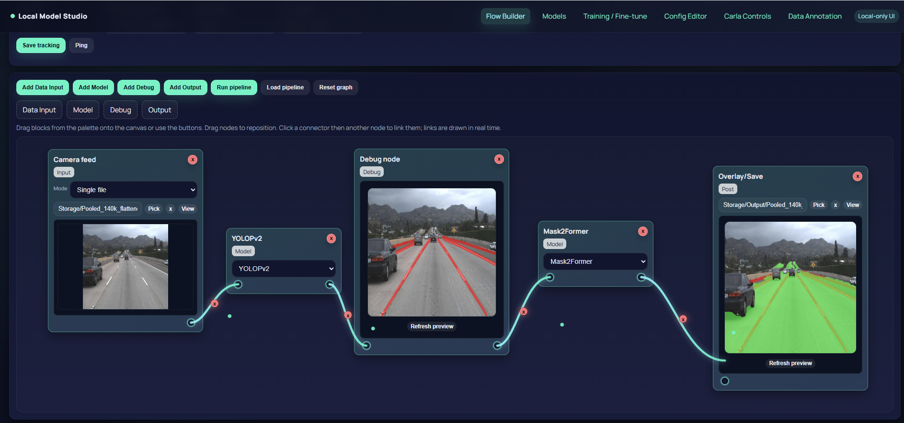
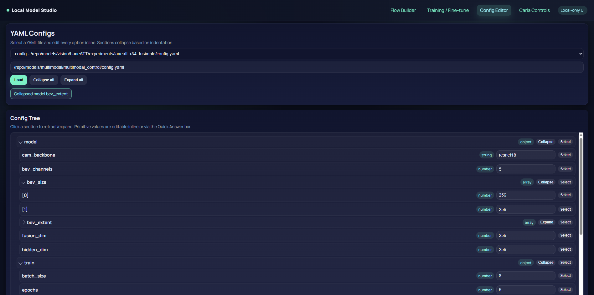

# Local Model Studio

The **Local Model Studio** is an integrated workspace for developing autonomous-driving intelligence from end to end. It brings together a complete robotaxi data loop, modular multimodal perception models, and a lightweight language-model pipeline for converting natural language into structured commands.  
Its goal is to make dataset creation, experimentation, and evaluation intuitive, reproducible, and technically powerful.

---

## What This Repository Provides

### Robotaxi Data Loop  
A synchronized capture-and-replay engine that records RGB cameras, LiDAR sweeps, GNSS positions, and IMU signals with deterministic timing.  
This enables precise reconstruction of driving scenes for training and evaluation.

- High-fidelity alignment of all sensor modalities  
- Deterministic playback for reproducible experiments  
- Partial-modal configurations for isolating sensors or debugging  
- Designed to support both large-scale datasets and targeted scenario captures  

  

---

### Vision & BEV Models  
A modular perception stack providing both **partial-BEV fusion** and **camera-only** baselines.

#### Partial-BEV Models  
Models that fuse:  
- camera features  
- LiDAR projections  
- vehicle state  

into a clean top-down bird’s-eye-view representation, ideal for steering and path prediction.

#### Camera-Only Models  
Lightweight models optimized for limited VRAM while maintaining real-time inference characteristics.

Key characteristics:  
- Easily swappable backbones  
- Extensible fusion blocks  
- Suitable for rapid experimentation and research workflows  

  

---

### Command-to-CLI LLMs  
A compact language-to-action pipeline powered by **TinyLlama LoRA**, enabling natural language to drive simulation and tooling.

This component provides:  
- domain-specific dataset generation utilities  
- fine-tuning workflows  
- evaluation metrics for both exact-match and semantic accuracy  

It bridges human intent and executable commands, enabling automated CARLA scenario generation and structured tool orchestration.

---

## UI at a Glance

### Flow Builder  
A visual node-based interface for assembling perception pipelines, linking models, and previewing outputs in real time.

### Config Editor  
A YAML tree viewer and editor that exposes the configuration of every model, dataset, or processing step inside the repo.

Users can explore, refine, and export configurations cleanly, ensuring experiment repeatability.

---

## How the Studio Fits Together  
The ecosystem is designed so each component reinforces the others:

- **Record synchronized data**  
- **Replay with perfect determinism**  
- **Train BEV or camera-only models**  
- **Evaluate through consistent pipelines**  
- **Prototype visually using the Flow Builder**  
- **Control the system using TinyLlama-generated CLI commands**

The Local Model Studio is compact yet powerful — a foundation for research, prototyping, and production-ready autonomous-driving workflows.

---
